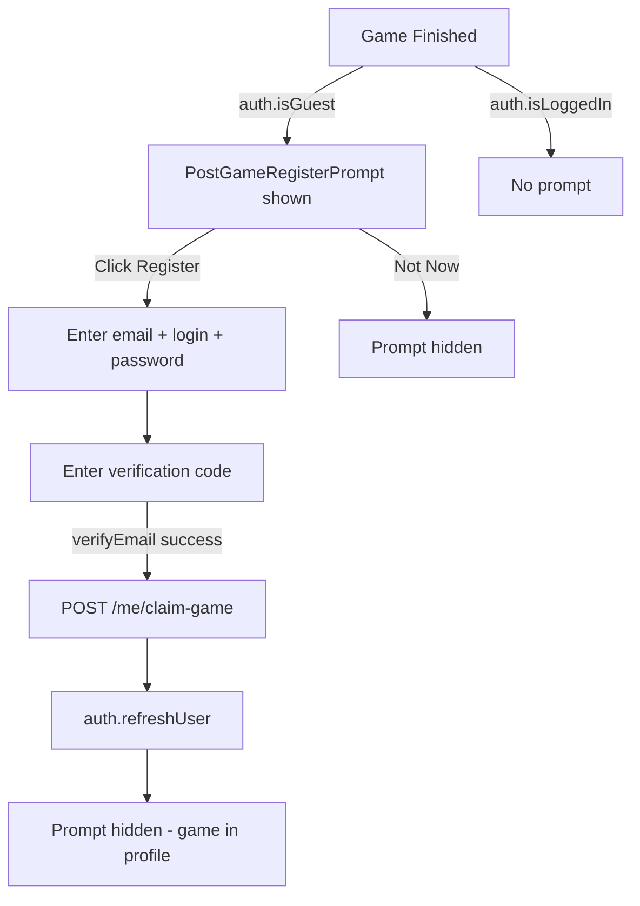

# Plan: 4 Fixes — Solo History, Header, Guest Name, Post-Game Register

## Decisions

| # | Decision |
|---|----------|
| 1 | **PvP claiming**: Add `sessionId` to `S2C_GameOver` so client can claim PvP games |
| 2 | **Guest display name**: `'Гость'` shown in game UI; reserved login stays `'guest'` (internal) |
| 3 | **Post-game registration flow**: Standard 2-step flow (register → verify email code) |

---

## Issue 1 — Solo game history: wrong viewer identification + bot name missing

### Root Cause

[`GameRow`](packages/frontend/src/pages/ProfilePage/ProfilePage.tsx:46) finds the viewer participant by:

```tsx
const viewer = game.participants.find((p) => p.name === viewerLogin);
```

- `p.name` = free-text name at game time (e.g. `"Вася"` or `"Гость"`)
- `viewerLogin` = account login (e.g. `"vasya123"`)

These are different fields — `viewer` is always `undefined` → `isWon` is always `false`.

Also, `GameParticipantRecord` in [`useProfile.ts`](packages/frontend/src/hooks/useProfile.ts:42) has no `userId` field, making frontend matching by ID impossible.

Additionally, bot name in `session_start` uses the default fallback `Бот (normal)` because `App.tsx` doesn't send `botName`.

### Fix

**Step 1 — API: expose `userId` in participants response**

[`GET /users/:login/games`](packages/api/src/routes/users.ts:120) — add `userId` to the participants `select`:

```ts
participants: {
  select: { userId: true, color: true, name: true, isBot: true, isWinner: true }
}
```

**Step 2 — Frontend: add `userId` to `GameParticipantRecord`**

[`useProfile.ts`](packages/frontend/src/hooks/useProfile.ts:42):
```ts
export interface GameParticipantRecord {
  userId: string | null;  // ADD
  color: string;
  name: string;
  isBot: boolean;
  isWinner: boolean;
}
```

**Step 3 — ProfilePage: match by userId**

[`ProfilePage.tsx`](packages/frontend/src/pages/ProfilePage/ProfilePage.tsx:45):
```tsx
function GameRow({ game, viewerUserId }: { game: GameRecord; viewerUserId: string | null }) {
  const viewer   = viewerUserId ? game.participants.find((p) => p.userId === viewerUserId) : null;
  const opponent = game.participants.find((p) => p.userId !== viewerUserId);
  const isWon    = viewer?.isWinner ?? false;
  ...
}
```

The caller passes `auth.user?.id ?? null`.

**Step 4 — App.tsx: send `botName` and `userId` in `session_start`**

```ts
logSoloEvent({
  kind: 'session_start',
  sessionId: sid,
  playerName: meta.humanName,
  humanColor: meta.humanColor,
  difficulty: meta.difficulty,
  config: meta.config,
  botName: `Бот (${DIFFICULTY_LABELS[meta.difficulty]})`,
  userId: auth.user?.id ?? undefined,
});
```

### Files Changed

| File | Change |
|------|--------|
| `packages/api/src/routes/users.ts` | Add `userId` to participants SELECT in `GET /:login/games` |
| `packages/frontend/src/hooks/useProfile.ts` | Add `userId: string \| null` to `GameParticipantRecord` |
| `packages/frontend/src/pages/ProfilePage/ProfilePage.tsx` | Match viewer by `userId`; pass `viewerUserId` prop |
| `packages/frontend/src/App.tsx` | Add `botName` + `userId` to `session_start` payload |

---

## Issue 2 — Header buttons stretch to full header height

### Root Cause

`.settingsAnchor` uses `display: inline-block` ([`App.module.css`](packages/frontend/src/App.module.css:265)). Inside the flex `.headerActions` container the anchor div becomes a flex item — without an explicit height constraint the button inside can fill its natural height but the anchor itself may have unexpected sizing.

### Fix

Change `.settingsAnchor` to `display: flex; align-items: center`:

```css
.settingsAnchor {
  position: relative;
  display: flex;
  align-items: center;
}
```

### Files Changed

| File | Change |
|------|--------|
| `packages/frontend/src/App.module.css` | `.settingsAnchor`: `display: inline-block` → `display: flex; align-items: center` |

---

## Issue 3 — Remove name input; use auth login or 'Гость'

### Design

- **Authenticated users**: game display name = `auth.user.login`
- **Guests**: game display name = `'Гость'` (UI label)
- Reserved login `'guest'` in DB — nobody can register with it
- Name input completely removed from Lobby UI
- `playerName` derived in `App.tsx` from auth state

### Changes

**Step 1 — Reserve 'guest' in `authService.ts`**

[`authService.ts`](packages/api/src/services/authService.ts:35) `register()` — add check before DB query:

```ts
const RESERVED_LOGINS = ['guest', 'admin', 'system'];

export async function register(email, login, password) {
  if (RESERVED_LOGINS.includes(login.toLowerCase())) {
    return { error: 'LOGIN_TAKEN' };
  }
  // ...existing code
}
```

**Step 2 — Remove name input from Lobby**

[`Lobby.tsx`](packages/frontend/src/components/Lobby/Lobby.tsx) — remove:
- `name` state + `nameErr` state
- `NAME_STORAGE_KEY` constant
- The name `<input>` and error `<div>`
- Name validation in `handleCreate`, `handleJoin`, `handleStartSolo`

**Step 3 — Update Lobby callback signatures**

```ts
interface LobbyProps {
  onCreateRoom: (timeControl: TimeControl) => void;  // no name
  onJoinRoom:   (roomId: string) => void;            // no name
  onStartSolo?: (difficulty: Difficulty, humanColor: PlayerColor) => void; // no name
}
```

**Step 4 — App.tsx: derive name from auth**

```ts
const playerName = auth.isGuest ? 'Гость' : (auth.user?.login ?? 'Гость');
```

Pass `playerName` to `createRoom`, `joinRoom`, `startSolo`.

**Step 5 — Pass `userId` to solo backend recorder**

In `App.tsx` `onSession` `session_start` callback, add `userId: auth.user?.id ?? undefined`.

### Files Changed

| File | Change |
|------|--------|
| `packages/api/src/services/authService.ts` | Add reserved login check |
| `packages/frontend/src/components/Lobby/Lobby.tsx` | Remove name input; update callback signatures |
| `packages/frontend/src/components/Lobby/Lobby.module.css` | Remove name-related input styles |
| `packages/frontend/src/App.tsx` | Derive `playerName` from auth; update Lobby callbacks |

---

## Issue 4 — Post-game registration offer for guests; claim game to new account

### Design

After any completed game, if the player is a guest, show a prompt overlay on the finished screen:

```
┌──────────────────────────────────────────┐
│  🎮 Хочешь сохранить статистику?         │
│                                          │
│  Зарегистрируйся — и эта игра появится   │
│  в твоём профиле автоматически.          │
│                                          │
│  [Зарегистрироваться]   [Не сейчас]      │
└──────────────────────────────────────────┘
```

Flow:
1. Guest sees the prompt on game end
2. Clicks "Register" → standard 2-step (register → verify email code) inline within the prompt
3. On successful auth: `POST /users/me/claim-game { sessionId, color }` is called
4. Backend links the `GameParticipant` row to the new `userId`, increments stats
5. `auth.refreshUser()` is called → profile updates
6. Prompt disappears

### S2C_GameOver — add `sessionId` field

In [`packages/shared/src/types.ts`](packages/shared/src/types.ts:130):
```ts
export interface S2C_GameOver {
  winnerColor: PlayerColor | null;
  reason: string;
  sessionId?: string;  // ADD — for game claiming by guest
}
```

In [`packages/backend/src/index.ts`](packages/backend/src/index.ts:203), when emitting `gameOver` to clients, include the `sessionId` from the game recorder meta. The recorder already knows `meta.sessionId` — pass it through the `logGameFinishedIfNeeded` → `finalizeGameOver` chain or emit it directly in the `gameOver` socket event.

In [`packages/backend/src/roomManager.ts`](packages/backend/src/roomManager.ts:713) `finalizeGameOver`, return the `sessionId` so `index.ts` can include it in the socket event.

In [`packages/frontend/src/App.tsx`](packages/frontend/src/App.tsx), `gameOver.sessionId` is available once the socket event arrives. Store `myColor` + `gameOver.sessionId` and pass them to `PostGameRegisterPrompt`.

For solo: `soloSessionIdRef.current` already exists in `App.tsx`.

### Backend — New Endpoint `POST /users/me/claim-game`

In [`packages/api/src/routes/users.ts`](packages/api/src/routes/users.ts):

```ts
// POST /users/me/claim-game
// Body: { sessionId: string; color: 'red' | 'blue' }
// Auth: Bearer token required
app.post('/me/claim-game', async (request, reply) => {
  // 1. Verify JWT → userId
  // 2. Find GameParticipant where game.sessionId = sessionId AND color = color
  // 3. Check participant.userId is null (unclaimed)
  // 4. Set participant.userId = userId
  // 5. Upsert UserProfile stats (increment gamesPlayed, wins if isWinner)
  // 6. Return { ok: true }
});
```

### New Component — `PostGameRegisterPrompt`

`packages/frontend/src/components/PostGameRegisterPrompt/PostGameRegisterPrompt.tsx`

Props:
```ts
interface Props {
  sessionId: string;
  color: 'red' | 'blue';
  auth: AuthApi;
  onDismiss: () => void;
}
```

Internally renders the standard register → verify flow (reusing [`RegisterModal`](packages/frontend/src/components/Auth/RegisterModal.tsx) logic inline or as a shared component). On `setAuthed` success, calls `claimGame(sessionId, color, token)` then `auth.refreshUser()`.

### UX Flow



### Files Changed

| File | Change |
|------|--------|
| `packages/shared/src/types.ts` | Add `sessionId?: string` to `S2C_GameOver` |
| `packages/backend/src/roomManager.ts` | Return `sessionId` from `finalizeGameOver` |
| `packages/backend/src/index.ts` | Include `sessionId` in `gameOver` socket emit |
| `packages/api/src/routes/users.ts` | Add `POST /me/claim-game` endpoint |
| `packages/frontend/src/App.tsx` | Show `PostGameRegisterPrompt` on finished screen for guests; pass sessionId + color |
| `packages/frontend/src/components/PostGameRegisterPrompt/PostGameRegisterPrompt.tsx` | New component |
| `packages/frontend/src/components/PostGameRegisterPrompt/PostGameRegisterPrompt.module.css` | Styles |

---

## Summary — All Files

### New Files

| File | Purpose |
|------|---------|
| `src/components/PostGameRegisterPrompt/PostGameRegisterPrompt.tsx` | Guest post-game registration offer |
| `src/components/PostGameRegisterPrompt/PostGameRegisterPrompt.module.css` | Styles |

### Modified Files

| File | Issues |
|------|--------|
| `packages/shared/src/types.ts` | #4 — add sessionId to S2C_GameOver |
| `packages/backend/src/roomManager.ts` | #4 — return sessionId from finalizeGameOver |
| `packages/backend/src/index.ts` | #4 — include sessionId in gameOver socket emit |
| `packages/api/src/routes/users.ts` | #1 (userId in participants), #4 (claim-game endpoint) |
| `packages/api/src/services/authService.ts` | #3 — reserve 'guest' login |
| `packages/frontend/src/hooks/useProfile.ts` | #1 — add userId to GameParticipantRecord |
| `packages/frontend/src/pages/ProfilePage/ProfilePage.tsx` | #1 — match by userId |
| `packages/frontend/src/App.module.css` | #2 — settingsAnchor display fix |
| `packages/frontend/src/App.tsx` | #1 (botName+userId in session_start), #3 (playerName from auth), #4 (show prompt) |
| `packages/frontend/src/components/Lobby/Lobby.tsx` | #3 — remove name input |
| `packages/frontend/src/components/Lobby/Lobby.module.css` | #3 — remove name input styles |
