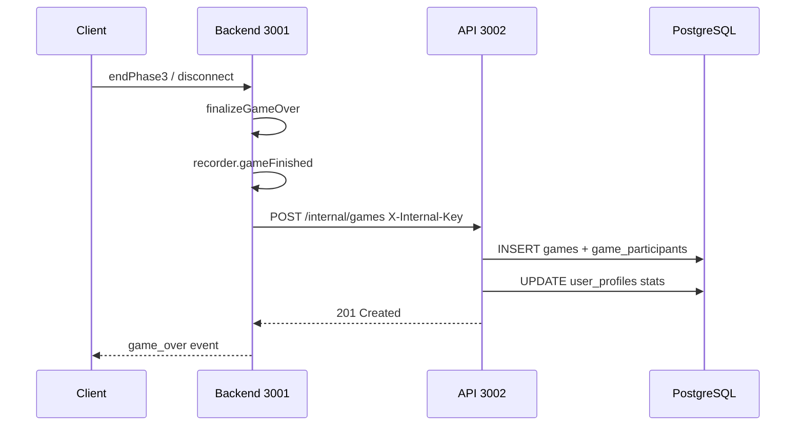

# План: Страница профиля + История игр

## Обзор

Три взаимосвязанных изменения:
1. **БД**: расширение схемы Prisma — новые поля в `UserProfile`, новая таблица `Game` + `GameParticipant`
2. **Бэкенд**: запись завершённых PvP/solo-игр в БД через API
3. **Фронтенд**: роутинг + страница `/profile/:login` + навигация из дропдауна

---

## Архитектурные решения

### Хранение логов для реплея

**Решение**: сохранять `logPath` (относительный путь до директории лога) в поле `Game.logPath`.  
Пример: `pvp/alice-bob-2026-06-30_14-30-00`

- Существующий просмотрщик продолжает работать как прежде
- В будущем можно добавить in-app реплей по `logPath`
- При архивировании старых логов поле можно обнулить
- Aborted-игры не попадают в счётчики и не создают запись в `games`

### Запись игр из Backend → API

Backend (Socket.IO, порт 3001) и API (Fastify, порт 3002) живут в одной Docker-сети.  
**Решение**: Backend при завершении игры делает `POST http://api:3002/internal/games` с заголовком `X-Internal-Key: <INTERNAL_API_KEY>`.

Это чище, чем дублировать Prisma в backend, и проще, чем общая шина сообщений.

### Клиентский роутинг

**Решение**: добавить `react-router-dom` v6. nginx уже имеет `try_files $uri $uri/ /index.html` — всё готово.  
Маршруты: `/` (игра, текущий App), `/profile/:login` (новая страница).

### Рейтинговые игры

Пока нет механики рейтинговых игр — поле `isRated` в `Game` будет всегда `false`. Счётчики `ratedGamesPlayed` и `ratedWins` в `UserProfile` добавляются заранее под будущую механику.

---

## Часть 1: База данных (Prisma Schema)

**Файл**: `packages/api/src/prisma/schema.prisma`

### Изменения в `UserProfile`

```prisma
model UserProfile {
  id                String   @id @default(uuid())
  userId            String   @unique
  user              User     @relation(fields: [userId], references: [id], onDelete: Cascade)
  avatarUrl         String?
  bio               String?           // ← НОВОЕ: текст «о себе»
  rating            Int      @default(1000)
  gamesPlayed       Int      @default(0)
  wins              Int      @default(0)
  ratedGamesPlayed  Int      @default(0)  // ← НОВОЕ
  ratedWins         Int      @default(0)  // ← НОВОЕ
  tournamentsPlayed Int      @default(0)  // ← НОВОЕ (для будущего)
  tournamentWins    Int      @default(0)  // ← НОВОЕ (для будущего)
  updatedAt         DateTime @updatedAt
  @@map("user_profiles")
}
```

### Новые модели

```prisma
model Game {
  id          String   @id @default(uuid())
  sessionId   String   @unique
  mode        String   // 'pvp' | 'solo'
  isRated     Boolean  @default(false)
  startedAt   DateTime
  endedAt     DateTime
  durationMs  Int
  turnsPlayed Int      @default(0)
  winnerColor String?  // 'red' | 'blue' | null (ничья)
  winReason   String   // 'lives' | 'headquarters' | 'time' | 'draw' | 'aborted'
  logPath     String?  // относительный путь до директории лога
  createdAt   DateTime @default(now())

  participants GameParticipant[]

  @@index([startedAt(sort: Desc)])
  @@map("games")
}

model GameParticipant {
  id       String  @id @default(uuid())
  gameId   String
  game     Game    @relation(fields: [gameId], references: [id], onDelete: Cascade)
  userId   String?
  user     User?   @relation(fields: [userId], references: [id], onDelete: SetNull)
  color    String  // 'red' | 'blue'
  name     String
  isBot    Boolean @default(false)
  isWinner Boolean @default(false)

  @@map("game_participants")
}
```

И добавить `participants GameParticipant[]` в модель `User`.

---

## Часть 2: API — новые эндпоинты

### Новые переменные окружения

```
INTERNAL_API_KEY=<random-secret>  # shared secret для backend → api
MAX_AVATAR_SIZE_MB=2              # лимит загрузки аватара (опционально)
```

### Новые роуты в `packages/api/src`

#### `POST /internal/games` — запись завершённой игры

- Требует заголовок `X-Internal-Key: <INTERNAL_API_KEY>`
- Принимает: sessionId, mode, isRated, startedAt, endedAt, durationMs, turnsPlayed, winnerColor, winReason, logPath, participants[]
- Создаёт запись в `games` + `game_participants`
- Обновляет `UserProfile` (gamesPlayed, wins, ratedGamesPlayed, ratedWins) для каждого участника с userId

#### `GET /users/:login` — публичный профиль

- Возвращает: login, avatarUrl, bio, rating, emailVerified (если это сам пользователь), статистику из UserProfile
- Не требует авторизации (публичный)

#### `GET /users/:login/games?page=1&limit=25` — история игр

- Пагинация: по 25 штук, сортировка по `startedAt DESC`
- Возвращает: массив игр с участниками, total (для пагинации)
- Не требует авторизации (публичный)

#### `PATCH /users/me/profile` — обновление профиля

- Требует JWT
- Поля: `bio` (string | null), `avatarUrl` (string | null — URL уже загруженной картинки)

#### `POST /users/me/avatar` — загрузка аватара

- Требует JWT
- multipart/form-data, поле `avatar` (image/*)
- Сохраняет файл в `/app/uploads/avatars/<userId>.<ext>`
- Возвращает URL: `/uploads/<userId>.<ext>`
- Нужна отдача статики: nginx `location /uploads/ { ... }` или отдача через Fastify static

#### `POST /auth/resend-verification` — повторная отправка кода

- Требует JWT (или email в теле)
- Создаёт новый `EmailVerification`, отправляет письмо

---

## Часть 3: Backend — запись игр в API

### `packages/backend/src/gameRecorder.ts`

Добавить функцию `reportGameToApi(meta: GameMeta, participants: ParticipantInfo[])`:
- Вызывается из `gameFinished()` если игра не aborted
- `fetch('http://api:3002/internal/games', { method: 'POST', ... })`
- При ошибке — только лог, не крашить сервер

### `packages/backend/src/roomManager.ts`

В `finalizeGameOver()`:
- Передавать `loginId` (userId) участников в recorder, чтобы `reportGameToApi` мог отправить их в API
- Это потребует, чтобы при joinRoom передавался userId (если пользователь авторизован через сокет)

**Проблема**: сейчас сокет не знает userId игрока.  
**Решение**: при подключении клиент отправляет JWT-токен в handshake (или отдельным событием `authenticate`). Backend валидирует токен, достаёт userId, сохраняет в PlayerState.

### `packages/shared/src/types.ts`

Добавить поле `userId?: string` в события `createRoom` / `joinRoom`.

---

## Часть 4: Фронтенд

### 4.1 Роутинг

- Установить `react-router-dom` v6
- `packages/frontend/src/main.tsx` — обернуть в `<BrowserRouter>`
- `packages/frontend/src/App.tsx` → переименовать в `GameApp.tsx` (собственно игровой экран)
- Новый `App.tsx` с `<Routes>`:
  - `<Route path="/" element={<GameApp />} />`
  - `<Route path="/profile/:login" element={<ProfilePage />} />`

### 4.2 Навигация из дропдауна

В `ProfileButton.tsx` — добавить пункт «👤 Мой профиль» → `navigate('/profile/' + auth.user.login)`

### 4.3 Компоненты страницы профиля

#### `ProfilePage.tsx` (`packages/frontend/src/pages/ProfilePage/`)

Структура страницы:

```
┌──────────────────────────────────────────────┐
│  [Аватар / Буква]  alice                     │
│                    bio (если заполнено)       │
│                    📧 alice@example.com  ✓    │
│                    ⭐ Рейтинг: uncalibrated   │
│                    [✏️ Редактировать профиль] │
│                    (только если это я)        │
└──────────────────────────────────────────────┘

Статистика — карточки в ряд:
┌────────┬────────┬──────────┐
│ Игры   │ Победы │  Win%    │
│   25   │   18   │  72%     │
├────────┼────────┼──────────┤
│ Рейтинг│ Рейт.В │ Рейт.W%  │
│   10   │   7    │  70%     │
├────────┴────────┴──────────┤
│ Турниры: 0  |  Победы: 0  │
└────────────────────────────┘

История игр:
┌──────────┬─────────────┬──────┬────────┬──────┬──────────┬─────┐
│ Дата     │ Соперник    │ Режим│ Рейт.  │ Ходы │ Длительн │ W/L │
├──────────┼─────────────┼──────┼────────┼──────┼──────────┼─────┤
│30.06 14:30│ Bob (🔴)   │ PvP  │   ✓    │  12  │  8m 32s  │  ✓  │
│30.06 12:15│ Бот (🔵)   │ Solo │        │   8  │  5m 10s  │  ✗  │
└──────────┴─────────────┴──────┴────────┴──────┴──────────┴─────┘
[← Пред]  Страница 1 / 3  [След →]
```

#### Режим редактирования (в-страница, не отдельная)

При клике «✏️ Редактировать» — поля инлайн становятся редактируемыми:
- Аватар: клик на картинку → `<input type="file" accept="image/*">`
- Bio: `<textarea>` вместо текста
- Кнопки «Сохранить» / «Отмена»

#### Подтверждение почты в профиле

Если `emailVerified === false` и это мой профиль:
- Баннер: «⚠️ Email не подтверждён. [Подтвердить]»
- Клик → открывает модалку верификации (повторный запрос кода + ввод)

### 4.4 Хук `useProfile`

```ts
useProfile(login: string) → {
  profile: PublicProfile | null,
  games: GameRecord[],
  totalGames: number,
  page: number,
  setPage: (n: number) => void,
  isLoading: boolean,
  isMe: boolean,
  updateProfile: (bio, avatarUrl) => Promise<void>,
  uploadAvatar: (file: File) => Promise<string>,
}
```

---

## Часть 5: Хранение аватаров

### Вариант A: Файловая система в volume Docker
- nginx отдаёт `/uploads/` как статику
- Просто, работает сразу
- ⚠️ При пересборке образа — файлы теряются (нужен volume)

**Рекомендация**: Вариант A с Docker volume `uploads-data:/app/uploads`.

`docker-compose.yml` — добавить volume `uploads-data` к сервису `api`.  
`nginx.conf` — добавить `location /uploads/ { proxy_pass http://api:3002/uploads/; }`.  
API — подключить `@fastify/static` для раздачи `/app/uploads/`.

---

## Диаграмма потока данных при завершении игры



---

## Порядок реализации (todo-задачи)

### Блок 1 — БД и API
1. Обновить Prisma schema: новые поля UserProfile, модели Game + GameParticipant
2. Добавить `INTERNAL_API_KEY` в `.env.example` и `docker-compose.yml`
3. Реализовать `POST /internal/games` (запись игры + обновление статистики)
4. Реализовать `GET /users/:login` (публичный профиль)
5. Реализовать `GET /users/:login/games` (история с пагинацией)
6. Реализовать `PATCH /users/me/profile` (bio, avatarUrl)
7. Реализовать `POST /users/me/avatar` (загрузка файла, @fastify/multipart + @fastify/static)
8. Реализовать `POST /auth/resend-verification`
9. Добавить volume `uploads-data` в docker-compose, nginx proxy для `/uploads/`

### Блок 2 — Backend: userId в сокете + запись игр
10. Добавить событие `authenticate { token }` в shared types + socket handshake
11. В `roomManager.ts` — хранить `userId` в `PlayerState`
12. В `gameRecorder.ts` / `roomManager.ts` — вызов `reportGameToApi` при завершении игры (не aborted)
13. Аналогично для solo-игр в `backend/src/index.ts`

### Блок 3 — Фронтенд
14. Установить `react-router-dom` v6, настроить `BrowserRouter` в `main.tsx`
15. Рефакторинг App: `GameApp.tsx` + новый `App.tsx` с Routes
16. ProfilePage: карточка профиля + статистика
17. ProfilePage: список игр с пагинацией
18. ProfilePage: режим редактирования (bio + аватар)
19. ProfilePage: баннер верификации email + повторный запрос кода
20. Добавить `useProfile` хук
21. `ProfileButton` → добавить «👤 Мой профиль» в дропдаун с `navigate`
22. При JWT-handshake — отправлять токен в socket для идентификации userId

---

## Открытые вопросы для обсуждения

1. **Рейтинговые игры**: как будет определяться, является ли игра рейтинговой? Специальная кнопка при создании комнаты? Или все PvP-игры рейтинговые?
2. **Публичность профиля**: доступен ли список игр без авторизации для всех? Или только для самого пользователя?
3. **Аватар**: разрешить только URL (например, ссылка на gravatar или imgur) или реализовать загрузку файла? Загрузка файла сложнее, но удобнее.
4. **Рейтинг**: ELO-система при завершении рейтинговых игр — входит ли в этот план или отдельная задача?
