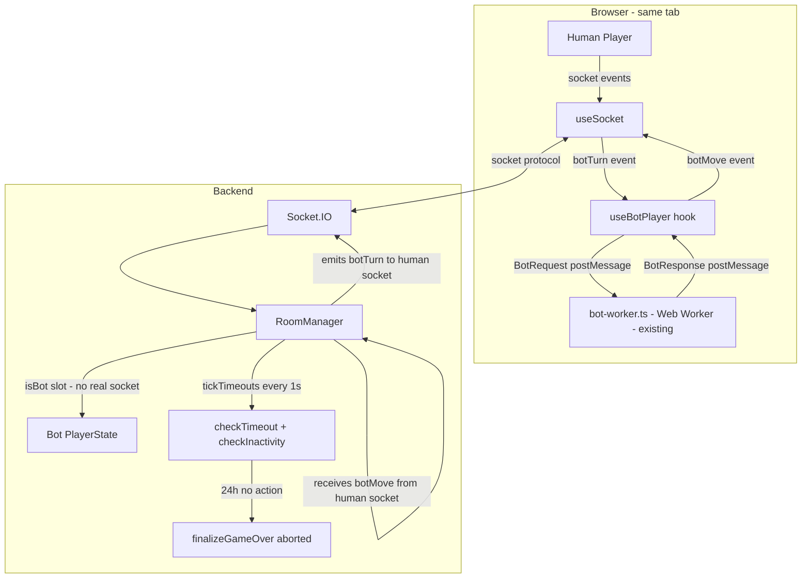
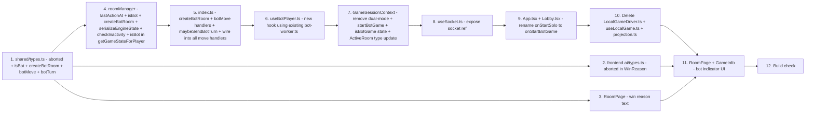

# Plan: Server-authoritative Bot Games, Win Reason Display & Inactivity Timeout

## Overview

Three related features that fix the broken "Active Games" UX and improve the game lifecycle:

1. **Server-authoritative bot games** — Server owns the game state (same as PvP). Bot AI still runs in the player's browser via the existing Web Worker (`bot-worker.ts`); it receives a `botTurn` event, computes a move with MCTS in the worker, and sends it back via `botMove`. No AI code moves to the backend. `LocalGameDriver` and `useLocalGame` are deleted.
2. **Win reason display** — Show a human-readable explanation of why the game ended.
3. **Inactivity timeout (24h)** — Abort untimed games (including bot games) after 24h of no moves.
4. **Bot indicator in RoomPage** — Show a 🤖 visual cue next to the bot opponent's info panel.

---

## Architecture Diagram



**Key principle**: The server is authoritative. The browser runs the bot in a Web Worker (existing `bot-worker.ts`) and submits its moves via socket — same protocol as PvP. Server validates and applies every move.

---

## Feature 1: Server-authoritative Bot Games

### 1.1 Shared types — [`packages/shared/src/types.ts`](packages/shared/src/types.ts)

**Add `'aborted'` to `S2C_GameOver.reason`:**
```ts
reason: 'lives' | 'headquarters' | 'time' | 'surrender' | 'aborted'
```

**Add `isBot?: true` to the shared `PlayerState`** (so frontend can render bot indicator):
```ts
export interface PlayerState {
  color: PlayerColor;
  name: string;
  lives: number;
  minesLeft: number;
  timeLeftMs?: number;
  isBot?: true;          // NEW
}
```

**Add `createBotRoom` to `ClientToServerEvents`:**
```ts
createBotRoom: (opts: {
  playerName: string;
  difficulty: 'easy' | 'normal' | 'hard';
  humanColor: 'red' | 'blue';
  userId?: string;
}) => void;
```

**Add `botMove` to `ClientToServerEvents`** (browser sends computed bot move):
```ts
botMove: (move: BotMovePayload) => void;
```

**Add `BotMovePayload` type** (union of all game actions the bot can take):
```ts
export type BotMovePayload =
  | { type: 'placeMineSetup'; row: number; col: number }
  | { type: 'confirmSetup' }
  | { type: 'selectZone'; row: number; col: number }
  | { type: 'captureCell'; row: number; col: number }
  | { type: 'defuseCell'; row: number; col: number }
  | { type: 'chord'; row: number; col: number }
  | { type: 'endPhase2' }
  | { type: 'placeMinePhase3'; row: number; col: number }
  | { type: 'endPhase3' }
  | { type: 'forfeit' };
```

**Add `botTurn` to `ServerToClientEvents`** (server signals: bot's turn, here is the full state):
```ts
botTurn: (snapshot: BotTurnSnapshot) => void;

export interface BotTurnSnapshot {
  botColor: 'red' | 'blue';
  difficulty: 'easy' | 'normal' | 'hard';
  // Full engine state as plain JSON (no Map/Set)
  phase: import('./types').GamePhase;
  board: import('./types').CellState[][];
  players: Array<{
    color: 'red' | 'blue';
    mines: Array<{ row: number; col: number }>;
    lives: number;
    minesPlaced: number;
  }>;
  turn: {
    currentPlayer: 'red' | 'blue';
    phase: string;
    zonesSelected: number;
    minesPlacedThisTurn: number;
    currentTurnStartedAtMs: number;
  } | null;
  config: import('./types').GameConfig;
}
```

> **Why send full state including hidden mines?** Human and bot are the same browser tab — no cheating concern. Sending full state lets the bot run MCTS with complete information, which is how `LocalGameDriver` worked.

### 1.2 Backend — `PlayerState` bot flag — [`packages/backend/src/roomManager.ts`](packages/backend/src/roomManager.ts:41)

```ts
export interface PlayerState {
  // existing fields...
  isBot?: true;
  botDifficulty?: 'easy' | 'normal' | 'hard';
}
```

### 1.3 Backend — `Room` additions — [`packages/backend/src/roomManager.ts`](packages/backend/src/roomManager.ts:59)

```ts
export interface Room {
  // existing fields...
  lastActionAt: number;    // Feature 3: inactivity tracking
  botSocketId?: string;    // Human's socket ID — where to send botTurn events
}
```

### 1.4 Backend — `createBotRoom()` method in `RoomManager`

```ts
createBotRoom(
  humanSocketId: string,
  tabId: string,
  playerName: string,
  difficulty: 'easy' | 'normal' | 'hard',
  humanColor: PlayerColor,
  ip: string,
  userId?: string
): Room
```

Responsibilities:
1. Generate room ID (existing `generateRoomId()`)
2. Create room with `timeControl: null` (no timer)
3. Add human player as `humanColor`
4. Add bot pseudo-player as opposite color: `{ name: 'Bot', color: opposite, isBot: true, botDifficulty: difficulty, socketId: '__bot__' }`
5. Set `room.botSocketId = humanSocketId`
6. **Skip waiting phase** — immediately advance to setup phase (both players considered "ready")
7. Set `lastActionAt = Date.now()`
8. Return room

### 1.5 Backend — `serializeEngineState()` helper in `RoomManager`

New method that converts the internal `Room` board/state into a `BotTurnSnapshot` — plain JSON-serializable, includes full hidden mine positions. Used to populate `botTurn` events.

### 1.6 Backend — `getGameStateForPlayer()` — add `isBot` to emitted `PlayerState`

When `broadcastGameState` calls `getGameStateForPlayer()`, the returned `PlayerState[]` should include `isBot: true` for bot players. This lets the frontend render the bot indicator without extra events.

In [`packages/backend/src/roomManager.ts`](packages/backend/src/roomManager.ts:912):
```ts
getGameStateForPlayer(room: Room, color: PlayerColor) {
  // ...existing code...
  players: room.players.map(p => ({
    color: p.color,
    name: p.name,
    lives: p.lives,
    minesLeft: p.minesLeft,
    timeLeftMs: this.getTimeLeftMs(room, p.color),
    isBot: p.isBot,   // NEW
  })),
}
```

### 1.7 Backend — Socket handlers in `index.ts` — [`packages/backend/src/index.ts`](packages/backend/src/index.ts)

**New `createBotRoom` handler:**
```ts
socket.on('createBotRoom', ({ playerName, difficulty, humanColor, userId }) => {
  const room = roomManager.createBotRoom(
    socket.id, tabId, playerName, difficulty, humanColor, ip, userId
  );
  socket.join(room.id);
  socket.emit('roomCreated', { roomId: room.id, playerColor: humanColor });
  broadcastGameState(room.id);
  maybeSendBotTurn(room);  // trigger immediately if bot goes first in setup
});
```

**New `botMove` handler:**
```ts
socket.on('botMove', (move: BotMovePayload) => {
  const room = roomManager.getRoom(socket.id);
  if (!room) return;
  const bot = room.players.find(p => p.isBot);
  if (!bot) return;

  switch (move.type) {
    case 'placeMineSetup':  roomManager.placeMineSetup(room, bot.color, move.row, move.col); break;
    case 'confirmSetup':    roomManager.confirmSetup(room, bot.color); break;
    case 'selectZone':      roomManager.selectZone(room, bot.color, move.row, move.col); break;
    case 'captureCell':     roomManager.captureCell(room, bot.color, move.row, move.col); break;
    case 'defuseCell':      roomManager.defuseCell(room, bot.color, move.row, move.col); break;
    case 'chord':           roomManager.chordCapture(room, bot.color, move.row, move.col); break;
    case 'endPhase2':       roomManager.endPhase2(room, bot.color); break;
    case 'placeMinePhase3': roomManager.placeMinePhase3(room, bot.color, move.row, move.col); break;
    case 'endPhase3':       roomManager.endPhase3(room, bot.color); break;
    case 'forfeit':         roomManager.surrender(room, bot.color); break;
  }

  broadcastGameState(room.id);
  if (room.phase !== 'finished') maybeSendBotTurn(room);
});
```

**New `maybeSendBotTurn()` helper:**
```ts
function maybeSendBotTurn(room: Room): void {
  const bot = room.players.find(p => p.isBot);
  if (!bot || !room.botSocketId || room.phase === 'finished') return;

  // Check if it's bot's turn (setup phase or playing phase)
  const isBotTurn = /* check current player color matches bot.color */;
  if (!isBotTurn) return;

  const snapshot = roomManager.serializeEngineState(room);
  io.to(room.botSocketId).emit('botTurn', {
    ...snapshot,
    botColor: bot.color,
    difficulty: bot.botDifficulty!,
  });
}
```

**Wire `maybeSendBotTurn` into all existing human move handlers:**
```ts
socket.on('captureCell', ({ row, col }) => {
  const room = roomManager.getRoom(socket.id);
  if (!room) return;
  roomManager.captureCell(room, playerColor, row, col);
  broadcastGameState(room.id);
  maybeSendBotTurn(room);  // ← add this line to every handler
});
// Same for: placeMineSetup, confirmSetup, selectZone, defuseCell,
//           chord, endPhase2, placeMinePhase3, endPhase3, toggleMark
```

### 1.8 Frontend — New hook `useBotPlayer` — [`packages/frontend/src/hooks/useBotPlayer.ts`](packages/frontend/src/hooks/useBotPlayer.ts) (NEW)

Replaces `LocalGameDriver` + `useLocalGame` for active bot games. Uses the **existing** [`bot-worker.ts`](packages/frontend/src/ai/bot-worker.ts) Web Worker.

```ts
export function useBotPlayer(
  socket: Socket | null,
  isActive: boolean  // true only when in a bot room
): void
```

Internal flow on receiving `botTurn`:
1. Reconstruct `BotObservation` from `BotTurnSnapshot` (same logic as `LocalGameDriver.buildBotObservation()`)
2. Get difficulty config from `snapshot.difficulty` using `getDifficultyConfig()`
3. For **setup phase**: use synchronous setup AI from [`setup.ts`](packages/frontend/src/ai/engine/setup.ts) (same as `LocalGameDriver.scheduleBotSetup()`)
4. For **turn phase**: post `BotRequest` to the existing Web Worker (`bot-worker.ts`), await `BotResponse`
5. Apply human-like delay: reuse the `pickIntraTurnDelay(phase)` logic from deleted `LocalGameDriver`
6. Emit `botMove` to socket
7. The server will send another `botTurn` if the bot needs more sub-moves in the same turn

**Worker lifecycle**: Create the worker once when `isActive` becomes true, terminate it when game ends or `isActive` becomes false.

### 1.9 Frontend — Simplify `GameSessionContext` — [`packages/frontend/src/context/GameSessionContext.tsx`](packages/frontend/src/context/GameSessionContext.tsx)

**Remove:**
- `gameMode: 'pvp' | 'solo'` state
- `soloSession` — the entire `useLocalGame` call
- `SoloSnapshot` / `loadSoloSnapshot` / snapshot restore logic
- `startSolo()` function
- All imports from `useLocalGame` and `LocalGameDriver`

**Keep:**
- `activeRooms` in localStorage — now bot games have real server room IDs, so existing `restoreSession` works
- Single `pvpSession` from `useSocket`

**Add:**
- `isBotGame: boolean` state — set to `true` when `startBotGame` is called, cleared on `returnToMenu`
- `startBotGame(difficulty, humanColor)` — emits `createBotRoom` via socket
- Wire `useBotPlayer(socket, isBotGame)` inside the provider

**`ActiveRoom` additions** (to restore bot game context on reconnect):
```ts
export interface ActiveRoom {
  // existing fields...
  isBotGame?: boolean;
  botDifficulty?: 'easy' | 'normal' | 'hard';
}
```

When `upsertActiveRoom` is called for a bot game, save `isBotGame: true` + `botDifficulty`. On restore, load these from localStorage → set `isBotGame` state → `useBotPlayer` re-activates.

**Context value:**
```ts
// Before
startSolo: (difficulty: Difficulty, humanColor: PlayerColor, soloRoomId: string) => void;
gameMode: 'pvp' | 'solo';

// After
startBotGame: (difficulty: Difficulty, humanColor: PlayerColor) => void;
// gameMode removed — component can check gameState.players.some(p => p.isBot) instead
```

### 1.10 Frontend — `useSocket.ts` — [`packages/frontend/src/hooks/useSocket.ts`](packages/frontend/src/hooks/useSocket.ts)

Expose the raw `socket` ref so `useBotPlayer` can attach its `botTurn` listener:
```ts
// Add to returned object:
socket: socketRef.current  // Socket | null
```

Or alternatively, `useBotPlayer` can be called inside `useSocket` itself and `botMove` emits can go through the existing `socket.emit` wrapper.

### 1.11 Frontend — Delete obsolete files

Files to delete entirely:
- `packages/frontend/src/ai/driver/LocalGameDriver.ts`
- `packages/frontend/src/ai/driver/useLocalGame.ts`
- `packages/frontend/src/ai/driver/projection.ts` — only used by `useLocalGame`

Files to keep (still used by `useBotPlayer`):
- `packages/frontend/src/ai/bot-worker.ts` ✓
- `packages/frontend/src/ai/types.ts` ✓
- `packages/frontend/src/ai/difficulty.ts` ✓
- `packages/frontend/src/ai/engine/` (all files) ✓
- `packages/frontend/src/ai/patterns/` (all files) ✓

### 1.12 Frontend — `App.tsx` and `Lobby.tsx`

- [`packages/frontend/src/App.tsx`](packages/frontend/src/App.tsx): `onStartSolo` → `onStartBotGame`
- [`packages/frontend/src/components/Lobby/Lobby.tsx`](packages/frontend/src/components/Lobby/Lobby.tsx): rename callback prop, same signature minus `soloRoomId`

---

## Feature 2: Win Reason Display

### 2.1 Add `'aborted'` to `WinReason` everywhere

- [`packages/shared/src/types.ts`](packages/shared/src/types.ts): `S2C_GameOver.reason` — done in 1.1
- [`packages/frontend/src/ai/types.ts`](packages/frontend/src/ai/types.ts): `WinReason = 'lives' | 'headquarters' | 'time' | 'surrender' | 'aborted'`
- [`packages/backend/src/roomManager.ts`](packages/backend/src/roomManager.ts): local `WinReason` type

### 2.2 Win reason text in `RoomPage` — [`packages/frontend/src/pages/RoomPage/RoomPage.tsx`](packages/frontend/src/pages/RoomPage/RoomPage.tsx)

Add helper and render it as a muted subtitle under the winner name in the finished-game screen:

```ts
function winReasonText(reason: S2C_GameOver['reason']): string {
  switch (reason) {
    case 'headquarters': return 'Штаб захвачен';
    case 'lives':        return 'Все жизни иссякли';
    case 'time':         return 'Время истекло';
    case 'surrender':    return 'Игрок сдался';
    case 'aborted':      return 'Игра прервана из-за бездействия';
  }
}
```

---

## Feature 3: Inactivity Timeout (24h)

### 3.1 `lastActionAt` in `Room`

Already included in section 1.3. Set to `Date.now()` in `createRoom`, `createBotRoom`, and every action method: `placeMineSetup`, `confirmSetup`, `selectZone`, `captureCell`, `defuseCell`, `chordCapture`, `endPhase2`, `placeMinePhase3`, `endPhase3`, `toggleMark`, `surrender`.

Bot moves go through the same `roomManager` methods via the `botMove` handler, so `lastActionAt` is updated automatically.

### 3.2 `checkInactivity()` in `tickTimeouts()` — [`packages/backend/src/roomManager.ts`](packages/backend/src/roomManager.ts:871)

```ts
tickTimeouts(): Room[] {
  const finished: Room[] = [];
  for (const room of this.rooms.values()) {
    if (room.phase === 'finished') continue;
    if (this.checkTimeout(room)) { finished.push(room); continue; }
    if (this.checkInactivity(room)) { finished.push(room); }
  }
  return finished;
}

private checkInactivity(room: Room): boolean {
  if (room.config.timeControl !== null) return false; // timed: handled by checkTimeout
  if (room.phase !== 'setup' && room.phase !== 'playing') return false;
  const LIMIT_MS = 24 * 60 * 60 * 1000;
  if (Date.now() - room.lastActionAt < LIMIT_MS) return false;

  const currentPlayer = room.turn?.currentPlayer ?? room.players[0].color;
  const winner = currentPlayer === 'red' ? 'blue' : 'red';
  this.finalizeGameOver(room, winner, 'aborted');
  return true;
}
```

### 3.3 Timed games — no changes needed

`checkTimeout()` runs clock on the server every 1s regardless of connection status. Natural timeout → `'time'` reason. No changes.

---

## Feature 4: Bot Indicator in `RoomPage`

### 4.1 Display logic

In [`packages/frontend/src/pages/RoomPage/RoomPage.tsx`](packages/frontend/src/pages/RoomPage/RoomPage.tsx), the `gameState.players` array now includes `isBot: true` for bot players (sent by backend in `getGameStateForPlayer`).

In the opponent's `GameInfo` panel (and in the finished screen), check `isBot` and render a 🤖 emoji or "Бот" badge next to the opponent's name.

Example in the opponent `GameInfo` header:
```tsx
const opponentName = opponent.isBot
  ? `🤖 ${opponent.name}`
  : opponent.name;
```

The `GameInfo` component already receives `playerState` — add handling for `isBot` in its rendering. Or pass `isBot` as a separate prop if simpler.

Also in the finished screen header/subtitle:
```tsx
{opponent.isBot && <span className={styles.botBadge}>🤖 Игрок-бот</span>}
```

---

## Implementation Order



### Step-by-step checklist

1. **`packages/shared/src/types.ts`** — add `'aborted'`; `isBot` in `PlayerState`; `createBotRoom` + `botMove` C→S; `botTurn` + `BotTurnSnapshot` + `BotMovePayload` S→C; remove `soloLog` from `ClientToServerEvents`
2. **`packages/frontend/src/ai/types.ts`** — add `'aborted'` to `WinReason`
3. **`packages/backend/src/roomManager.ts`** — add `'aborted'` to local `WinReason`; add `lastActionAt`, `botSocketId`, `isBot`, `botDifficulty`; update all action methods to set `lastActionAt`; add `createBotRoom()`; add `serializeEngineState()`; add `checkInactivity()`; include `isBot` in `getGameStateForPlayer()`
4. **`packages/frontend/src/pages/RoomPage/RoomPage.tsx`** — add `winReasonText()`, render in finished screen
5. **`packages/backend/src/index.ts`** — add `createBotRoom` + `botMove` handlers; add `maybeSendBotTurn()`; wire into every human move handler; remove `soloLog` handler
6. **`packages/frontend/src/hooks/useBotPlayer.ts`** — new hook; `botTurn` listener; setup AI (setup.ts) + MCTS worker (bot-worker.ts); human-like delay; emits `botMove`; worker lifecycle
7. **`packages/frontend/src/hooks/useSocket.ts`** — expose `socket` ref in returned object
8. **`packages/frontend/src/context/GameSessionContext.tsx`** — remove dual-mode; add `isBotGame` state; add `startBotGame`; wire `useBotPlayer`; update `ActiveRoom` type; remove `startSolo`, `soloSession`, snapshot restore
9. **`packages/frontend/src/App.tsx`** — `onStartSolo` → `onStartBotGame`
10. **`packages/frontend/src/components/Lobby/Lobby.tsx`** — rename prop `onStartSolo` → `onStartBotGame`
11. **Delete** `packages/frontend/src/ai/driver/LocalGameDriver.ts`, `useLocalGame.ts`, `projection.ts`
12. **`packages/frontend/src/components/GameInfo/GameInfo.tsx`** — accept/render `isBot` flag for opponent name display
13. **`packages/frontend/src/pages/RoomPage/RoomPage.tsx`** — pass `isBot` to `GameInfo`; bot badge in finished screen
14. **Build check** — `yarn workspace @minesweeper/shared build && yarn workspace @minesweeper/backend build && yarn workspace @minesweeper/frontend build`

---

## Summary — New Files

| File | Purpose |
|---|---|
| `packages/frontend/src/hooks/useBotPlayer.ts` | Client bot hook: receives `botTurn`, runs MCTS in existing Web Worker, emits `botMove` |

## Summary — Deleted Files

| File | Reason |
|---|---|
| `packages/frontend/src/ai/driver/LocalGameDriver.ts` | Replaced by `useBotPlayer` + server-authoritative rooms |
| `packages/frontend/src/ai/driver/useLocalGame.ts` | Same |
| `packages/frontend/src/ai/driver/projection.ts` | Only used by `useLocalGame` |

---

## Summary — Modified Files

| File | Change |
|---|---|
| [`packages/shared/src/types.ts`](packages/shared/src/types.ts) | `'aborted'`; `isBot` in `PlayerState`; `createBotRoom` + `botMove` C→S; `botTurn` + `BotTurnSnapshot` + `BotMovePayload` S→C |
| [`packages/frontend/src/ai/types.ts`](packages/frontend/src/ai/types.ts) | `'aborted'` in `WinReason` |
| [`packages/backend/src/roomManager.ts`](packages/backend/src/roomManager.ts) | `'aborted'`; `lastActionAt`; `botSocketId`; `isBot`/`botDifficulty` in `PlayerState`; `createBotRoom()`; `serializeEngineState()`; `checkInactivity()`; `isBot` in `getGameStateForPlayer()` |
| [`packages/backend/src/index.ts`](packages/backend/src/index.ts) | `createBotRoom` + `botMove` handlers; `maybeSendBotTurn()`; wired into all move handlers; remove `soloLog` |
| [`packages/frontend/src/pages/RoomPage/RoomPage.tsx`](packages/frontend/src/pages/RoomPage/RoomPage.tsx) | `winReasonText()` in finished screen; bot badge; pass `isBot` to `GameInfo` |
| [`packages/frontend/src/components/GameInfo/GameInfo.tsx`](packages/frontend/src/components/GameInfo/GameInfo.tsx) | Render 🤖 prefix or badge when `isBot` is true |
| [`packages/frontend/src/hooks/useSocket.ts`](packages/frontend/src/hooks/useSocket.ts) | Expose raw `socket` ref |
| [`packages/frontend/src/context/GameSessionContext.tsx`](packages/frontend/src/context/GameSessionContext.tsx) | Remove dual-mode; `startBotGame`; `isBotGame` state; `ActiveRoom` type update; wire `useBotPlayer` |
| [`packages/frontend/src/App.tsx`](packages/frontend/src/App.tsx) | `onStartSolo` → `onStartBotGame` |
| [`packages/frontend/src/components/Lobby/Lobby.tsx`](packages/frontend/src/components/Lobby/Lobby.tsx) | Rename `onStartSolo` → `onStartBotGame` prop |

---

## Open Questions / Decisions

| Decision | Choice |
|---|---|
| Bot AI location | Stays in `packages/frontend/src/ai/` — zero migration |
| Bot compute thread | Existing `bot-worker.ts` Web Worker — no main-thread blocking |
| Server authority | Server owns game state; bot sends moves via socket same as human |
| Bot state for MCTS | Full `EngineState` snapshot sent in `botTurn` (safe: same browser tab) |
| Bot turn delay | Reuse `pickIntraTurnDelay()` logic inline in `useBotPlayer` (800–1800ms per action) |
| timeControl for bot games | `null` (no timer) — 24h inactivity timeout applies |
| Waiting screen for bot games | Skipped — room goes directly to setup phase |
| `LocalGameDriver` / `useLocalGame` / `projection.ts` | Deleted — no longer needed |
| `soloLog` event | Removed from shared types and backend |
| Bot indicator | 🤖 prefix on opponent name in `GameInfo` + badge in finished screen |
